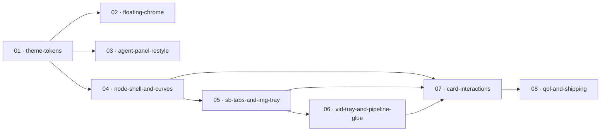

# 00 — Phase Index — Stori canvas-graph redesign

## Part 1 — Summary

```
Spec (primary):              /Users/praveen/Desktop/stori/canvas-redesign-mock.html
                             (illustrative for layout/structure only — color values
                              come from Aurora; see Part 4 #1 revised)
Spec (theme system):         /Users/praveen/Desktop/stori/css/themes.css (aurora.light)
                             /Users/praveen/Desktop/stori/index.html L17–60 (aurora.dark)
                             /Users/praveen/Desktop/stori/css/themes-inventory.md (canon)
Spec (code context):         js/29-canvas-render.js, js/27-canvas-state.js,
                             js/17c-create-pipeline.js, css/canvas-graph.css
Inventory:                   /Users/praveen/Desktop/stori/devDoc/.architect/spec-inventory.md
Phases:                      8           (cap = 9; one slot of headroom retained)
Coverage:                    96%         (49 of 51 sections mapped to a phase; +3 new
                                          Aurora-related sections, all mapped to ≥1 phase)
Out-of-scope sections:       2           (both reference-only; see Part 5)
Cross-cutting ADRs signaled: 12          (architect's 11 + new ADR-12 light-mode parity;
                                          conflicts #12 #13 folded into ADRs 1 and 2)
Estimated total duration:    M           (sum of XS / S phases; full redesign is multi-week)
Architect's 14-phase plan:   consolidated to 8 (rationale in Part 4)
Revision:                    1 (2026-05-01T00:30:00) — Aurora-first scope change
                                                       folded into P01 + ADR-1 + ADR-12
                                                       (no phase added or removed)
Critical conflicts resolved (in this index, then later in ADRs):
  • Left panel identity: keep + restyle #create-agent-panel; the mock's generic
    icon rail is illustrative only. Folded into ADR-1 + Phase 03.
  • Schema hierarchy: videoInstances are FLAT on scene, joined to imageInstance
    via sourceImageInstanceId. Folded into ADR-2 + Phase 06.
  • Action handler naming: architect's `regenImage` / `addVideoVariation` etc do
    not exist; ADR-6 + Phase 07 must reconcile (wrap or rename).
  • Theme system identity (revision 1): mock's hard-coded palette is illustrative;
    production reuses Aurora --lp-* for chrome and adds --sock-* / --cg-* only
    where Aurora doesn't cover the role. Both aurora.dark and aurora.light are
    first-class. Audio socket vs Aurora cyan accent collision resolved (audio
    remaps to teal/mint). Folded into ADR-1 + new ADR-12.
```

## Part 2 — Phases

| # | Slug | Name | Goal (1 line) | Entry criteria | Exit criteria | Duration | Depends on |
|---|------|------|---------------|----------------|---------------|----------|------------|
| 01 | theme-tokens | Aurora-derived Theme Tokens & Canvas Background | Establish the chrome + socket palette and dot-grid background that every later phase reads from, **derived from existing Aurora `--lp-*` tokens for chrome and adding `--sock-*` / `--cg-*` only for canvas-specific roles, in BOTH `aurora.dark` and `aurora.light`**. | none | (a) Chrome roles (bg-base / bg-elevated / bg-pill / border / border-strong / text / text-dim / text-faint / accent / accent-strong / danger) resolve to Aurora tokens via the existing `#create-page` remap (styles.css:404–418) — verify in both themes; document mapping in phase doc per ADR-1. No new `--cg-bg-*` / `--cg-text-*` variables invented where Aurora already covers the role. (b) New socket palette `--sock-script / --sock-image / --sock-video / --sock-audio / --sock-final` defined in `css/themes.css` for BOTH `[data-theme="dark"]` and `[data-theme="light"]`. **Audio socket = teal/mint (`#1ea895` light, oklch-equivalent dark — NOT Aurora cyan)** to avoid collision with `--lp-accent`; collision resolution documented as part of ADR-1. (c) New canvas-specific tokens (`--cg-grid-dot` and `--cg-pill-blur`, plus `--cg-danger` if Aurora's `--red` doesn't fit the canvas context) defined for both themes. (d) Canvas stage renders the dot grid (mock:117–119) in BOTH `aurora.dark` AND `aurora.light` — manually verify both themes. (e) Theme toggle (existing Aurora toggle) repaints canvas background, sockets, and curves without page reload — verify in both directions (dark→light, light→dark). (f) No visual regression in pre-existing canvas in either theme. (g) Phase doc explicitly lists every Aurora token reused vs every net-new token added, with the rationale for each addition. | XS | — |
| 02 | floating-chrome | Floating Chrome (Top Pill, Zoom Dock, Progress Strip & Telemetry) | Replace the existing canvas header chrome with the four floating, theme-aware, zoom-invariant chrome elements from the mock, **all chrome translucency / borders / accent / text colors sourced from Aurora `--lp-*`**. | 01 exits | (a) Top action pill renders all 12 controls (Project / Star / Undo / Redo / Share / drag-handle / batch stepper / Run / Run▾ / Cancel ✕ / "N active" status / right-pane toggle) with pill bg = `--lp-card` + `backdrop-filter: blur(var(--cg-pill-blur))`; Run + Cancel + batch stepper are wired to the existing pipeline (verify call site to `launchImageAgent` and to whatever cancel hook exists; do not invent). Run button uses `--lp-accent` (Aurora cyan) for primary chrome. (b) Bottom-right zoom dock replaces the current Tidy/−/%/+/Fit row; cursor-mode dropdown shows Select / Pan / Connect with Connect explicitly stubbed (visibly disabled or no-op); dock chrome uses `--lp-card` glass. (c) Top-right progress strip shows live `Total: x%` + bar + `Node: y%` during a run, hidden when idle, sourced from existing progress events (verify before implementing — see ADR-9 + inventory unanchored claim #8); progress bar fill = `--lp-accent`. (d) Bottom-left telemetry shows T / I / N / V / FPS in mono font; text color = `--lp-faint`. (e) All chrome elements are `position: fixed` or `position: absolute` outside the `#graph` zoom layer (ADR-9). (f) **Verify in `aurora.light` AND `aurora.dark`** (per ADR-12): chrome translucency, blur, accent button hover/focus rings, status pill, progress bar fill, telemetry text contrast all readable in both themes. Document any contrast issues found and how they are resolved. | S | 01 |
| 03 | agent-panel-restyle | Restyled Left Agent Panel | Restyle the existing `#create-agent-panel` to translucent narrow form with socket-color status dots and collapsible 56px icon strip — keep all existing agent-step content and click handlers, **chrome from Aurora `--lp-*`, status dots from `--sock-*` palette per ADR-1**. | 01 exits | (a) Panel renders at ~220–240px expanded width with translucent background (`--lp-card` or derived) — theme-aware. (b) Each agent step row shows a status dot whose color comes from the socket palette: Storyboard→`--sock-script` (yellow), Image→`--sock-image` (orange), Animation→`--sock-video` (purple), BGM→`--sock-audio` (teal/mint, NOT cyan — see ADR-1 collision resolution), Render→`--sock-final` (blue); Script row reuses `--sock-script`. (c) Collapse/expand toggle morphs panel between full-width and 56px icon strip; state persists across canvas mount/unmount. (d) Existing agent-step click handlers (verify in 17c-create-pipeline.js — `updateStepStates` at L807 and any click bindings) continue to work. (e) Click on an agent step row pans/zooms the canvas to that step's column band (`COL_LAUNCH` / `COL_BGM_*` / `COL_FINAL_*` from 29-canvas-render.js — mapping must be explicit, not inferred). (f) Mock's generic 56px icon rail (mock:80–110) is NOT used; this phase replaces it with the restyled agent panel (ADR-1). (g) **Verify in `aurora.light` AND `aurora.dark`** (per ADR-12): panel translucency reads correctly (dark: white-on-dark glass; light: dark-on-light glass), all 5 socket dots are visually distinct from the brand accent and from each other in both themes, collapsed-strip icons remain visible. | S | 01 |
| 04 | node-shell-and-curves | Node Shell, Sockets, Typed Curves, and Selection Outline | Rebuild the node base style: edge sockets on every node, type-colored bezier curves, 1px accent selection ring (no glow/shadow/scale), corner status dot, hover-dim of non-connected curves, **all colors from Aurora + `--sock-*` per ADR-1; selection ring = `--accent` (Aurora cyan in production)**. | 01 exits | (a) Every node type (SB, IMG, VID, BGM, Final, plus existing Launch and Subtitle nodes — verify Subtitle stays in scope) has `.sock.in` and/or `.sock.out` bumps positioned per mock (12px circle, top:16px, in left:-8px / out right:-8px) with the correct type color from `--sock-*`. (b) `redrawCurves` (29-canvas-render.js L1450) emits beziers between active-path pairs only; stroke comes from `getComputedStyle().getPropertyValue('--sock-' + type).trim()` (mock:651–652); 1.6px solid for active, dashed-1.2px for non-active path (mock:665). Final-node has in-socket only. **Because `getComputedStyle` resolves against the active `[data-theme]`, and `--sock-*` is defined in both themes (ADR-1), curves auto-theme on toggle.** (c) Card chrome shrink: card bg = `--bg-elevated` (resolves to Aurora-derived value via `#create-page` remap), card border = `--border` (= `--lp-card-bdr`); remove the existing glow/shadow/scale on `.node.selected`; replace with 1px `--accent` (= `--lp-accent`, Aurora cyan) border ring per mock:247–250. (d) Per-card status dot moved to top-right corner per mock:413–420. **States (ADR-1 collision resolution applied): done = `--sock-audio` (teal/mint, NOT cyan); running = `--sock-script` (yellow) + pulse; pending = `--text-faint`; error = `--cg-danger` (or Aurora `--red`).** (e) Hover any node → non-connected curves dim to 25% opacity; previous band/highlight system removed if it conflicts. (f) Theme toggle re-paints all sockets, curves, and selection rings via the token chain (no hard-coded colors). (g) Existing `--cg-zoom` counter-scale pattern (cg-css:1135–1148) preserved — no regression at zoom 0.25 / 1.0 / 2.5. (h) Specificity guard: any new selectors that target an element type also styled by `#create-page X` rules (styles.css:3677) use the `#create-canvas-step` prefix per ADR-11. (i) **Verify in `aurora.light` AND `aurora.dark`** (per ADR-12): all 5 socket colors are clearly visible against the card bg in both themes; selection ring contrast is readable in both; status dots are distinguishable from each other and from the brand accent in both themes; curve strokes have sufficient contrast against dot-grid background in both themes. | M | 01 |
| 05 | sb-tabs-and-img-tray | SB Tabs + IMG Variant Tray + Thumbnail Strip | Deliver multi-storyboard tabs A/B/+ on SB nodes and the IMG variant tray (dashed wrapper + ACTIVE card + thumbnail strip with vid-count badges + has-vids border + add tile) bound end-to-end to the real `isActive` / `isRenderActive` data model. **All tray/thumb chrome derives from Aurora; .has-vids border uses `color-mix` against Aurora-derived `--border`.** | 04 exits | (a) SB nodes render the `[A][B][+]` tab strip in `node-head` (mock:264–276). Click tab → call `CanvasState.setActiveStoryboard(scene, sbId)` (js27:222), re-render IMG tray. "+" → `CanvasState.addStoryboardInstance(scene, opts)` (js27:245). Tab pill colors derive from `--lp-card` (inactive) / `--accent` tint (active). (b) Each storyboard's IMG tray (dashed `.variant-tray`, mock:278–292) wraps the ACTIVE IMG card + thumb-strip; tray label reads `Img N · k variants`; tray border = `1px dashed var(--border-strong)` (= Aurora-derived). Tray rectangle auto-sizes to wrap content (mechanism documented — bounding-box calc, not hand-placed). (c) ACTIVE IMG card shows the `ACTIVE` pill (mock:306–313) using `color-mix(in oklch, var(--accent) 12%, transparent)` (Aurora cyan tint) and the image preview / inline ratio + seed steppers. ACTIVE = imageInstance with `isRenderActive === true` for that storyboard (illustrated mode) per ADR-2. (d) Thumb strip renders all sibling images as 56×36 numbered thumbs (mock:315–340). Click thumb → `CanvasState.setImageRenderActive(scene, imgId)` (js27:234), re-render IMG ACTIVE card and VID tray below it. "+" tile → existing add-variation pipeline (verify call site; if a canonical handler does not exist by name, this phase introduces `imgActions.addVariation` per ADR-6). (e) Each thumb shows the `▶N` `vid-badge` count (mock:343–353) sourced from `(scene.videoInstances || []).filter(v => v.sourceImageInstanceId === imgId).length` (the FLAT schema join, ADR-2); badge bg = `color-mix(in oklch, var(--sock-video) 80%, var(--bg-elevated))`. Thumbs with N > 0 carry the `.has-vids` purple-tinted border via `color-mix(in oklch, var(--sock-video) 60%, var(--border))` (mock:355–361). **Verify the mix percentage produces a visible-but-subtle border in BOTH `aurora.dark` AND `aurora.light`; tune per theme if needed.** (f) Switching active SB morphs IMG tray + VID tray below it; switching active IMG morphs VID tray. Curves redraw to follow the new active path (Phase 04 redrawCurves is sufficient). (g) Clicking a thumb sets that variant ACTIVE and SELECTED in the same gesture per ADR-4. (h) **Verify in `aurora.light` AND `aurora.dark`** (per ADR-12): tray dashed border visible in both themes; ACTIVE pill chip readable in both; vid-badge count chip readable in both (purple-on-dark vs purple-on-light); .has-vids border distinguishable from the default border in both. | M | 04 |
| 06 | vid-tray-and-pipeline-glue | VID Variant Tray + Pipeline Glue (animated mode) | Add the VID variant tray (mirror of IMG tray with play-icon overlay) for animated mode and add the missing pipeline-level `addVideoVariation` glue that wraps `CanvasState.addVideoInstance` end-to-end. **All chrome from Aurora; play-icon overlay color = `--sock-video` purple in both themes.** | 05 exits | (a) In animated mode, a VID variant tray appears next to the active IMG card; tray label `Vid N.A.k · v variants` (mock:556–558). Hidden in illustrated mode. Tray border = `1px dashed var(--border-strong)` matching IMG tray. (b) ACTIVE VID card mirrors IMG ACTIVE shape with play-icon overlay on preview, `--sock-video` (purple) type color and sockets, inline duration + model steppers (mock:560–576). ACTIVE = videoInstance with `isRenderActive === true` per scene per ADR-2. (c) VID thumb strip renders sibling videos for the active IMG only (filter by `sourceImageInstanceId`); each thumb has a play-icon mark (mock:824–826 illustrative). Click → `CanvasState.setVideoRenderActive(scene, vidId)` (js27:240). (d) "+" tile in VID strip generates a new video from the active IMG. Phase introduces a canonical pipeline-level handler `vidActions.addVariation(scene, sourceImageInstanceId)` that wraps `CanvasState.addVideoInstance` (js27:315) plus the existing video-generation pipeline (verify which existing call site triggers VEO/etc). ADR-6 records this naming. (e) Switching active IMG morphs VID tray correctly. Switching mode (illustrated ↔ animated) shows/hides VID tray without orphaning data. (f) **Verify in `aurora.light` AND `aurora.dark`** (per ADR-12): play-icon overlay readable on video preview in both themes; VID-tray dashed border + label chip readable in both; thumb play-mark visible against thumb bg in both. | M | 05 |
| 07 | card-interactions | Context Menu, Selection Toolbar, and Inline Steppers | Add right-click context menus + the floating selection toolbar (Regen / Variation / Download / Delete) above selected cards, and wire inline `◀ value ▶` steppers on every card body to the underlying instance fields. Both context menu and selection toolbar route through one canonical handler set per action (ADR-6). **Toolbar/menu chrome from Aurora `--lp-card` glass + Aurora accent for action buttons; Delete uses Aurora `--red`/`--cg-danger`.** | 04, 05, 06 exit | (a) Click-to-select on any node sets the SELECTED visual state (1px Aurora-cyan accent ring from Phase 04). Right-click any node opens a type-appropriate context menu (SB: Regen/Add Variant/Delete; IMG: Regen/Variation/Download/Delete; VID: Regen/Variation/Download/Delete; BGM: Regen/Skip; Final: Render). Menu bg = `--lp-card` glass; menu border = `--lp-card-bdr`. (b) Floating selection toolbar (mock:422–436) appears 72px above the selected card, mirrors the context menu items for that type. Toolbar lives inside the graph layer and counter-scales font via `--cg-zoom` per ADR-10 — readable at zoom 0.25. Toolbar bg = `--lp-card` glass; Delete button color = Aurora `--red` (or `--cg-danger`). (c) Both UIs call canonical handlers: `imgActions.regen / addVariation / download / delete`, `vidActions.regen / addVariation / download / delete`, `sbActions.addVariant / delete`. Each handler is defined once and wraps the existing implementation (`doDownloadImage` js29:2015; `doDeleteImage` js29:1956; `doDeleteVideo` js29:1962; `doDeleteSB` js29:1950; `doAddImageInstance` js29:1942; `window.regenerateScene` js17c:2814) plus the new `vidActions.addVariation` from Phase 06. Where a handler does not yet exist, this phase adds it per ADR-6. (d) Inline steppers (`◀ value ▶`) are wired on every applicable card body: SB (duration, style preset), IMG (aspect ratio, seed), VID (duration, model), BGM (Lyria/Library/Skip + volume), Final (resolution/fps). Stepper chrome uses `--lp-card` + `--lp-card-bdr`; arrow hover uses `--accent`. Click `◀` decrements / `▶` increments the underlying instance field with the persistence path documented per field. (e) Pressing Delete key while a card is SELECTED triggers the canonical delete handler with confirmation (Phase 08 also touches this; this phase establishes the handler). (f) Active vs Selected separation upheld per ADR-4: clicking a thumbnail makes that variant both ACTIVE and SELECTED; clicking on empty stage clears SELECTED but leaves ACTIVE alone. (g) **Verify in `aurora.light` AND `aurora.dark`** (per ADR-12): toolbar/menu glass readable in both themes; Delete `--red`/`--cg-danger` color contrast adequate in both; stepper arrow hover state visible in both; focus rings on toolbar buttons readable in both. | M | 04, 05, 06 |
| 08 | qol-and-shipping | QoL Interactions + Build-Pipeline Shipping | Marquee select on empty-stage drag, Delete key on selection, double-click socket creates next-stage node from defaults, migrate `canvas-graph.css` into the inline build pipeline, and **restyle Properties pane chrome to Aurora translucency in both themes**. | 07 exits | (a) Drag on empty stage with no modifier draws a marquee rectangle and selects all enclosed nodes (multi-select). Marquee fill = `color-mix(in oklch, var(--accent) 12%, transparent)`; marquee border = `1px solid var(--accent)`. Drag with current pan modifier still pans. Document the cursor-mode interaction (Select vs Pan from Phase 02 zoom-dock dropdown). (b) Delete key with one or more SELECTED cards triggers canonical delete handlers with confirmation, respecting the "cannot delete last" guard (`CanvasState.deleteImageInstance` returns false if it's the only image, js29:1957). (c) Double-click an out-socket on any non-Final node creates a new instance at the next pipeline stage with sensible defaults (SB out → new IMG via `CanvasState.addImageInstance`; IMG out → new VID via `vidActions.addVariation` from Phase 06; VID out → no-op since BGM/Final are singletons; BGM out → no-op). Document defaults explicitly per source type in the phase doc. (d) `canvas-graph.css` is added to `build.js` inline pipeline next to `styles.css` and `themes.css` (ADR-8). The `<link rel="stylesheet" href="css/canvas-graph.css?v=…">` in `index.html` is removed for `dist/`. Cache-bust query is removed. (e) `CANVAS_LAYOUT_VERSION` (js29:20) is bumped per ADR-3 since the redesign invalidates saved positions; `runLayout()` resets stale `canvasPosition` for users with old saved projects. (f) End-to-end smoke test: existing project loaded → all element-map entities (Part 4 of inventory) render correctly → Run pipeline produces a video → no console errors **in either `aurora.dark` OR `aurora.light`**. (g) Properties pane (right side) restyle pass — translucent (`--lp-card`) + dense rows + `--lp-card-bdr` borders, no big card chrome (mock-aligned). Scope: visual restyle only; no content/binding change. (h) **Verify in `aurora.light` AND `aurora.dark`** (per ADR-12): marquee fill/border visible in both themes; Properties pane translucency readable in both; no FOUC or stale-token regression on theme toggle after the build-pipeline migration; LAYOUT_VERSION migration runs cleanly in both themes. | S | 07 |

## Part 3 — Dependency DAG



Parallelizable bands (after P01 lands):
- Band 1: **P02** + **P03** can run concurrently (both depend only on P01; no shared files).
- Band 2: **P04** can run concurrently with P02/P03 (depends only on P01; touches different code areas — node renderers vs chrome). If team capacity is tight, run P04 strictly after P02/P03 to avoid CSS cascade conflicts.
- Band 3: **P05** must wait for P04.
- Band 4: **P06** must wait for P05.
- Band 5: **P07** must wait for P04 + P05 + P06.
- Band 6: **P08** must wait for P07.

## Part 4 — Rationale

### Why each phase

**01 · theme-tokens.** Foundational. The mock encodes every visual choice as a `--*` custom property; SVG curve strokes read these via `getComputedStyle()` at draw time (mock:651–652). **Revision 1 amendment:** the mock's hex values are illustrative only — production reuses Aurora `--lp-*` tokens (already defined for both `aurora.dark` and `aurora.light` in `index.html:17–60` and `css/themes.css:27–81`) for chrome / bg / border / text / accent. Net-new tokens are limited to (a) the socket palette `--sock-*` (with audio remapped from cyan to teal/mint to avoid collision with Aurora's cyan accent — see ADR-1), (b) `--cg-grid-dot` for the dot-grid alpha, (c) `--cg-pill-blur` for chrome backdrop blur, and possibly (d) `--cg-danger` if Aurora's `--red` doesn't fit the canvas error semantic. **All net-new tokens defined for BOTH themes per ADR-12.** This phase remains XS because it is purely additive CSS variable plumbing.

**02 · floating-chrome.** All four chrome elements (top pill, zoom dock, progress strip, telemetry) share the "outside the zoom layer" rule (ADR-9), all four read theme tokens from P01, and none of them depend on node-graph internals. Bundling them into one phase reduces churn on `index.html` + `canvas-graph.css` and lets the team ship a visibly redesigned canvas frame before any node work begins. **Revision 1:** chrome translucency / blur / accent buttons all derive from Aurora; verified in both themes per ADR-12.

**03 · agent-panel-restyle.** Kept separate from P02 because the `#create-agent-panel` is in `index.html` outside `#create-canvas-panel` (index.html:1974 vs L2476) and lives in a different DOM tree from the floating chrome. Its collapsibility + click-to-jump-to-column behavior is non-trivial. Resolves the conflict surfaced in inventory Part 4 #12 (folded into ADR-1): keep + restyle the existing agent panel rather than ship the mock's generic icon rail. **Revision 1:** status dot mapping uses the post-collision-resolution socket palette (BGM dot = teal/mint, not Aurora cyan); panel translucency from Aurora `--lp-card`; verified in both themes.

**04 · node-shell-and-curves.** Combines the architect's original P5 (sockets + typed curves), P6 (card chrome shrink + 1px ring), and P12 (curve hover-dim polish). All three modify the same set of files (`canvas-graph.css` for the visual shell + `js/29-canvas-render.js` for socket DOM and `redrawCurves`). Splitting them produces three M-sized phases that all touch overlapping code; merging produces one M-sized phase with a coherent acceptance criterion. **Revision 1:** card chrome (bg, border, selection ring) all derive from Aurora `--bg-elevated` / `--border` / `--accent` (which are themselves `--lp-*` aliases inside `#create-page`); curves auto-theme via `getComputedStyle` reading `--sock-*` per active `[data-theme]`. Verified in both themes per ADR-12.

**05 · sb-tabs-and-img-tray.** Combines architect's original P7 (SB tabs) and P8 (IMG variant tray). Both require the active-path traversal to be implemented end-to-end against the real schema (ADR-2 — `isActive` flag for SB, `isRenderActive` flag for IMG). They share render passes (`updateSBNode` and `updateImgNode` in 29-canvas-render.js) and share the "morph children when active changes" interaction logic. **Revision 1:** ACTIVE pill chip uses Aurora cyan tint; .has-vids border uses `color-mix` against Aurora-derived `--border`, with mix percentage tuned per theme if the dark recipe doesn't carry over to light (ADR-12 verification step).

**06 · vid-tray-and-pipeline-glue.** Kept standalone (NOT merged into P05) because it requires net-new pipeline glue that does not exist today. Inventory Part 4 #6 + #14 confirm: state-level `CanvasState.addVideoInstance` exists at js27:315, but the pipeline call site that generates a new video from the active IMG and writes the result back into the instance does NOT exist by name. This phase introduces `vidActions.addVariation`. **Revision 1:** play-icon overlay + thumb play-mark use `--sock-video` purple in both themes; tray dashed border identical pattern to IMG tray (Aurora-derived).

**07 · card-interactions.** Combines architect's original P10 (context menu + selection toolbar) and P11 (inline steppers). Both are card-internal interaction widgets. Both must reuse the canonical handlers introduced in this phase (ADR-6). Inline steppers depend on each card type existing (P04, P05, P06 done) so the per-field binding can be wired. **Revision 1:** toolbar/menu glass from Aurora `--lp-card`; Delete button color from Aurora `--red` (or `--cg-danger` if introduced in P01); focus rings derive from Aurora `--accent`; verified in both themes per ADR-12.

**08 · qol-and-shipping.** Combines architect's original P13 (QoL: marquee, Delete key, double-click socket) with the build-pipeline migration (ADR-8) and the LAYOUT_VERSION bump (ADR-3). The QoL items individually are XS but they collectively benefit from being shipped together as the closing phase. The build/version concerns belong here because they're zero-risk-of-regression changes that close out the redesign as a deployable bundle. **Revision 1:** Properties pane restyle uses Aurora `--lp-card` translucency; marquee fill/border uses Aurora cyan accent; smoke test runs in both themes per ADR-12.

### Considered and rejected

- **Considered keeping the architect's full 14-phase plan.** Rejected: hard-capped at 9. The merged structure above preserves every entity from the element map (verified in Part 5 + spec-coverage-matrix.md).
- **Considered splitting "node shell" (P04) into separate "sockets/curves" and "card chrome" phases.** Rejected: both edit the same `.node` / `.cg-*` rules in `canvas-graph.css` and the same `buildXxxNode` / `updateXxxNode` functions in `29-canvas-render.js`; splitting forces double-touching the same files and introduces ordering bugs.
- **Considered folding "agent panel restyle" (P03) into "floating chrome" (P02).** Rejected: agent panel lives in a separate DOM tree (index.html:1974, outside `#create-canvas-panel`), has its own state (collapse/expand), and has its own data binding (existing `updateStepStates` at 17c-create-pipeline.js L807). Different surface area, different cognitive load — keep separate.
- **Considered folding "VID tray + pipeline glue" (P06) into "SB tabs + IMG tray" (P05).** Rejected: P05 is pure data-binding work against existing state APIs; P06 introduces net-new pipeline integration. Different risk profile, different verification need. Keep separate.
- **Considered a dedicated "Properties pane" phase.** Rejected: the architect prompt scopes Properties pane work to "restyle to match" only — no content / binding changes. Folded into P08 as a closing visual pass. If scope expands later, lift it out into its own phase via revision mode.
- **Considered merging P07 "card interactions" into P05/P06 (one phase per card type).** Rejected: would force three near-duplicate context-menu + toolbar + stepper implementations across three phases. ADR-6 explicitly requires one canonical handler set per action; the cleanest expression is one phase that establishes those handlers and wires both UIs at once.
- **(Revision 1) Considered adding a dedicated "Aurora theme integration" phase.** Rejected: Aurora is the existing token system, not a new one. The integration is reuse-not-rebuild — every chrome / bg / border / text / accent role already has an Aurora token. The work is (a) reference Aurora tokens instead of mock hex codes (a small delta in P01 + acceptance bullets across P02–P08), (b) define `--sock-*` for both themes (P01), (c) resolve audio-vs-accent collision (ADR-1), (d) gate every later phase's acceptance on light-mode parity (ADR-12). None of this requires its own phase.
- **(Revision 1) Considered deferring `aurora.light` to a follow-up.** Rejected: the user explicitly requires both themes as first-class. Aurora's light variant is fully shipped and working today (`themes.css`); the redesign must not regress it. ADR-12 codifies the parity requirement.

### Slug stability note

If a future revision splits P04 or merges P02/P03, slugs `node-shell-and-curves` / `sb-tabs-and-img-tray` / `card-interactions` should NOT be renamed — split the contents but keep one slug as the canonical successor.

## Part 5 — Out of scope

| # | Spec section | Why out of scope |
|---|--------------|------------------|
| 1 | Inventory §21 — Mock — DOM: top header (`<div class="app-header">`) | reference / assumed baseline — the mock's top header is a placeholder that the redesign explicitly does not touch (architect prompt: "Top header (Stori): unchanged"). The real Stori header is governed by `index.html` outside the canvas panel and is not affected by this redesign. |
| 2 | Inventory §22 — Mock — DOM: left rail (12 generic icon entries) | deferred / superseded — the mock's generic icon rail is replaced in production by the restyled `#create-agent-panel` (P03). The mock's icons are illustrative for layout only and do not ship. (This is the conflict resolution from inventory Part 4 #12, folded into ADR-1.) |

> All other 49 inventory sections (incl. revision-1 additions §51 / §52 / §53) map to ≥ 1 phase. See `spec-coverage-matrix.md`.

## Part 6 — Flagged ADR candidates

| # | Decision topic | Phases affected | Recommendation |
|---|----------------|-----------------|----------------|
| 1 (revised) | **Theme token namespace — Aurora-first.** Reuse Aurora `--lp-*` for chrome / bg / border / text / accent (covered by existing `#create-page` remap at styles.css:404–418). Add `--sock-*` for the socket palette (5 type colors), defined in BOTH `aurora.dark` and `aurora.light` in `themes.css`. Add `--cg-*` ONLY for canvas-specific roles Aurora doesn't cover (`--cg-grid-dot`, `--cg-pill-blur`, optionally `--cg-danger`). **Audio-vs-accent collision resolution: mock's `--sock-audio: #4ee0c8` (cyan-teal) collides with Aurora cyan accent; remap socket-audio to teal/mint (e.g. `#1ea895` light + oklch-equivalent dark), preserving brand cyan for `--accent` only.** SVG curves read computed-style at draw time, so the auto-theme works for free given `--sock-*` is defined per `[data-theme]`. **Folds in conflict #12 (left-panel identity rule).** | 01, 02, 03, 04, 05, 06, 07, 08 | ADR — spans all phases; revised from prior version |
| 2 | Active-path source of truth — real model uses `isActive` (SB radio; IMG multi-select) and `isRenderActive` (IMG radio; VID radio); mock's `activeXxxIdx` numeric idx is illustrative only. **Folds in conflict #13 (videoInstances are FLAT on scene, joined via `sourceImageInstanceId`).** | 04, 05, 06, 07, 08 | ADR — spans 5 phases |
| 3 | `CANVAS_LAYOUT_VERSION` bump strategy — when to bump, how `runLayout` resets stale `canvasPosition`, mid-redesign user data semantics. | 04, 08 | ADR — spans 2 phases |
| 4 | Active vs Selected separation — ACTIVE = persisted instance flag; SELECTED = ephemeral UI; rules for click-thumbnail-also-selects, click-empty-stage-clears-selected-only. | 04, 05, 07, 08 | ADR — spans 4 phases |
| 5 | Variant-tray rendering strategy — DOM nodes for MVP; revisit at ~50+ thumbs per strip (canvas / virtualization). | 05, 06 | ADR — spans 2 phases |
| 6 | Action pipeline integration — one canonical handler per action (`imgActions.regen / addVariation / download / delete`; `vidActions.regen / addVariation / download / delete`; `sbActions.addVariant / delete`); both context menu and selection toolbar route through them; existing `do*` handlers in 29-canvas-render and `regenerateScene` in 17c-create-pipeline are wrapped, not duplicated; missing `vidActions.addVariation` is added in P06. | 05, 06, 07, 08 | ADR — spans 4 phases |
| 7 | Backwards compat for saved projects — legacy flat `imgDataUrl/videoUrl/videoClips` fields → instance arrays via `migrateAllScenes`; mirror direction is one-way (legacy→instances) but `syncMirrorFields` writes back FROM instances for older readers. Removal timeline. | 04, 05, 06, 08 | ADR — spans 4 phases |
| 8 | Build pipeline for `canvas-graph.css` — currently NOT inlined; decision: inline via `build.js` (recommended for cache-safety) vs keep separate `<link>` with `?v=` cache-bust. | 01, 04, 08 | ADR — spans 3 phases |
| 9 | Zoom-invariant chrome vs zoom-transformed graph — chrome is `position: fixed/absolute` outside `#graph`; node graph + curves inside `#graph` get the zoom transform; selection toolbar is INSIDE graph layer (transforms with node) and counter-scales font via `--cg-zoom`. | 02, 03, 04, 07 | ADR — spans 4 phases |
| 10 | Font sizing at low zoom — `calc(8px + 8px / var(--cg-zoom, 1))` partial inverse-scaling pattern (cg-css:967); reusable for selection toolbar buttons + steppers; rules for where the pattern applies. | 02, 04, 05, 06, 07 | ADR — spans 5 phases |
| 11 | Specificity guard — any selector targeting an element type already styled by `#create-page X` (styles.css:3677) must use `#create-canvas-step` prefix to win cascade order. Codify the rule for future canvas widgets. | 02, 03, 04, 05, 06, 07 | ADR — spans 6 phases |
| **12 (new) — Light-mode parity guarantee.** | Light and dark are not "modes" of unequal status. Every visual decision (sockets, curves, backgrounds, chrome translucency, focus rings, hover states, status dots, count badges, selection outlines, dot-grid alpha, marquee fill, Properties pane translucency, stepper chrome, ACTIVE pill chip, .has-vids border, vid-badge) must work and be tested in BOTH `aurora.dark` AND `aurora.light`. **Hazard pattern: developer designs in dark, light variant gets contrast/saturation issues** — e.g. cyan that pops on `--lp-bg: #050814` washes out on `--lp-bg: #eef2f7`; `color-mix` recipes calibrated to dark borders may produce invisible borders on light. Acceptance criteria across all phases must be checked in both themes. | 01, 02, 03, 04, 05, 06, 07, 08 | ADR — spans all phases; new in revision 1 |

> Conflicts #12 (left-panel identity) and #13 (schema hierarchy) from inventory Part 4 are **not** separate ADRs; they are folded into ADRs 1 and 2 respectively (decided here in the partition; ADR docs in Phase 5 of the architect cycle will reflect this consolidation).

> Revision 1 added **ADR-12 — light-mode parity guarantee** as a net-new ADR. Total ADR count: 12.

## Part 7 — Revision history

### Revision 1 — 2026-05-01T00:30:00 — Aurora-first scope change

**Trigger:** user directive — "we should use aurora theme. have it in plan. both dark and light."

**Diff vs prior partition:**

| What | Prior version | Revision 1 |
|---|---|---|
| Phase count | 8 | **8 (unchanged)** |
| Phase names / slugs | 01–08 as listed | **Identical (unchanged)** |
| Phase ordering / dependency DAG | as Part 3 | **Identical (unchanged)** |
| Phase 01 goal | "Establish chrome + socket palette and dot-grid background" | **"…derived from existing Aurora `--lp-*` tokens for chrome and adding `--sock-*` / `--cg-*` only for canvas-specific roles, in BOTH `aurora.dark` and `aurora.light`"** |
| Phase 01 exit criteria | (a)–(d) as before | **Restructured as (a)–(g): (a) Aurora chrome reuse mapping documented; (b) `--sock-*` defined for both themes with audio-collision resolution; (c) `--cg-*` only for canvas-specific roles; (d) dot grid in both themes; (e) theme toggle repaints; (f) no regression; (g) phase doc lists Aurora reuse vs net-new with rationale.** |
| Phase 02 acceptance | 6 bullets (a)–(f) | **Same 6 bullets, all annotated with Aurora token sources (`--lp-card`, `--lp-accent`, `--lp-faint`, etc.) instead of mock hex codes; final bullet (f) replaced with explicit "verify in `aurora.light` AND `aurora.dark`" per ADR-12.** |
| Phase 03 acceptance | 6 bullets, status-dot mapping with `--sock-audio` (cyan-green) for BGM | **Status-dot mapping updated: BGM = `--sock-audio` (teal/mint, NOT Aurora cyan) per ADR-1 collision resolution. New bullet (g) for both-themes verification per ADR-12.** |
| Phase 04 acceptance | 8 bullets (a)–(h) | **Same 8 bullets, with all color references now citing Aurora tokens (`--bg-elevated`, `--border`, `--accent`) instead of bare hex; status-dot states use post-collision-resolution colors. New bullet (i) for both-themes verification.** |
| Phase 05 acceptance | 7 bullets (a)–(g) | **Same 7 bullets, all chrome references now Aurora-derived; .has-vids `color-mix` percentage flagged for per-theme tuning per ADR-12. New bullet (h) for both-themes verification.** |
| Phase 06 acceptance | 5 bullets (a)–(e) | **Same 5 bullets, with chrome references now Aurora-derived; play-icon overlay color = `--sock-video` purple. New bullet (f) for both-themes verification.** |
| Phase 07 acceptance | 6 bullets (a)–(f) | **Same 6 bullets, with toolbar/menu glass = `--lp-card`, Delete = Aurora `--red`/`--cg-danger`, focus rings = Aurora `--accent`. New bullet (g) for both-themes verification.** |
| Phase 08 acceptance | 7 bullets (a)–(g) | **Same 7 bullets, with marquee fill/border = Aurora cyan; Properties pane = `--lp-card` translucency; smoke test runs in both themes. New bullet (h) for both-themes verification + LAYOUT_VERSION migration in both themes.** |
| Out-of-scope sections | §2 + §21 (header), §3 + §22 (left rail) | **Identical (unchanged)** |
| ADR count | 11 | **12** (added ADR-12 light-mode parity) |
| ADR-1 wording | "Theme token namespace (`--cg-*` canvas-scoped vs `--sock-*` socket-typed)" | **"Theme token namespace — Aurora-first" — Aurora reuse + `--sock-*` net-new + audio-collision resolution + `--cg-*` only where Aurora doesn't cover** |
| Coverage % | 96% (48 of 50) | **96% (49 of 51 — three new sections #51 / #52 / #53 added in inventory revision; all three map to P01 + downstream phases)** |

**What stayed the same:** Phase count (8). Phase names (theme-tokens, floating-chrome, agent-panel-restyle, node-shell-and-curves, sb-tabs-and-img-tray, vid-tray-and-pipeline-glue, card-interactions, qol-and-shipping). Dependency DAG. Out-of-scope sections (§2/§21 header, §3/§22 left rail). Specificity-guard ADR-11. Action-handler ADR-6. Schema-source-of-truth ADR-2. LAYOUT_VERSION ADR-3. Zoom-invariance ADR-9. Font-zoom-counter-scale ADR-10. All other ADRs unchanged in scope (some footnote tweaks where Aurora context tightens the recommendation).

**What changed:** ADR-1 broadened from "namespace" to "Aurora-first"; ADR-12 added; every phase's acceptance criteria gained a "verify in both themes" bullet; mock's hex codes recharacterized as illustrative only; audio socket remapped from cyan to teal/mint to avoid Aurora-accent collision; spec-inventory and coverage-matrix updated to add Aurora theme system as a first-class spec source.

## Part 8 — Artifacts (cross-links)

### Phase development docs

| # | Slug | File |
|---|------|------|
| 01 | theme-tokens | [`phase-01-theme-tokens.md`](phase-01-theme-tokens.md) |
| 02 | floating-chrome | [`phase-02-floating-chrome.md`](phase-02-floating-chrome.md) |
| 03 | agent-panel-restyle | [`phase-03-agent-panel-restyle.md`](phase-03-agent-panel-restyle.md) |
| 04 | node-shell-and-curves | [`phase-04-node-shell-and-curves.md`](phase-04-node-shell-and-curves.md) |
| 05 | sb-tabs-and-img-tray | [`phase-05-sb-tabs-and-img-tray.md`](phase-05-sb-tabs-and-img-tray.md) |
| 06 | vid-tray-and-pipeline-glue | [`phase-06-vid-tray-and-pipeline-glue.md`](phase-06-vid-tray-and-pipeline-glue.md) |
| 07 | card-interactions | [`phase-07-card-interactions.md`](phase-07-card-interactions.md) |
| 08 | qol-and-shipping | [`phase-08-qol-and-shipping.md`](phase-08-qol-and-shipping.md) |

### ADRs

| # | Title | File |
|---|-------|------|
| 001 | Theme token namespace (Aurora-first) | [`adr/ADR-001-theme-token-namespace.md`](adr/ADR-001-theme-token-namespace.md) |
| 002 | Active-path single source of truth + flat videoInstances schema | [`adr/ADR-002-active-path-source-of-truth.md`](adr/ADR-002-active-path-source-of-truth.md) |
| 003 | `CANVAS_LAYOUT_VERSION` bump strategy | [`adr/ADR-003-canvas-layout-version-bump.md`](adr/ADR-003-canvas-layout-version-bump.md) |
| 004 | Active vs Selected separation | [`adr/ADR-004-active-vs-selected.md`](adr/ADR-004-active-vs-selected.md) |
| 005 | Variant-tray rendering strategy | [`adr/ADR-005-variant-tray-rendering.md`](adr/ADR-005-variant-tray-rendering.md) |
| 006 | Action pipeline integration (canonical handlers) | [`adr/ADR-006-action-pipeline-integration.md`](adr/ADR-006-action-pipeline-integration.md) |
| 007 | Backwards compat for saved projects | [`adr/ADR-007-backwards-compat-saved-projects.md`](adr/ADR-007-backwards-compat-saved-projects.md) |
| 008 | Build pipeline (inline `canvas-graph.css`) | [`adr/ADR-008-build-pipeline.md`](adr/ADR-008-build-pipeline.md) |
| 009 | Zoom-invariant chrome vs zoom-transformed graph | [`adr/ADR-009-zoom-invariant-chrome.md`](adr/ADR-009-zoom-invariant-chrome.md) |
| 010 | Font sizing at low zoom (`--cg-zoom` partial counter-scale) | [`adr/ADR-010-font-zoom-counter-scale.md`](adr/ADR-010-font-zoom-counter-scale.md) |
| 011 | Specificity guard against `#create-page` global rules | [`adr/ADR-011-specificity-guard.md`](adr/ADR-011-specificity-guard.md) |
| 012 | Light-mode parity guarantee | [`adr/ADR-012-light-mode-parity.md`](adr/ADR-012-light-mode-parity.md) |

### Phase × ADR matrix

| Phase | ADRs consumed |
|---|---|
| P01 | 1, 8, 12 |
| P02 | 1, 9, 10, 11, 12 |
| P03 | 1, 9, 11, 12 |
| P04 | 1, 2, 3, 4, 9, 11, 12 |
| P05 | 1, 2, 4, 5, 6, 7, 10, 11, 12 |
| P06 | 1, 2, 4, 5, 6, 7, 12 |
| P07 | 1, 4, 6, 9, 10, 11, 12 |
| P08 | 3, 7, 8, 12 |

### Working files (not for engineer consumption directly)

- [`spec-coverage-matrix.md`](spec-coverage-matrix.md) — every spec section → phase mapping
- [`.architect/spec-inventory.md`](.architect/spec-inventory.md) — full spec ingestion
- [`.architect/run-log-2026-05-01-0000.md`](.architect/run-log-2026-05-01-0000.md) — architect orchestration log
